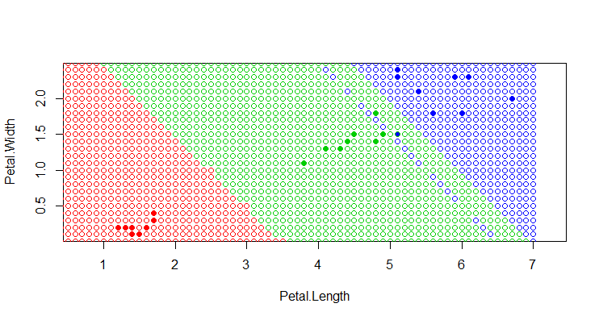

# Задачи класификации

<a href="#Vvonyye_opredeleniya">1. Вводные определения</a>

  
<a href="#Metricheskiye_algoritmy">2. Метрические алгоритмы</a>

  
<a href="#a1NN">2.1. 1NN</a>

  
<a href="#akNN">2.2. kNN</a>

  
<a href="#aLOO">2.3. LOO</a>

  
  ## 1. Вводные определения 
  
  
Задано множество объектов X, и множество допустимых ответов Y, и существует целевая функция y*: X -> Y, значения которой yi = y*(xi) известны только на конечном подмножестве объектов {x1, …, xℓ} ⊂ X.

  
Пары «объект-ответ» (xi, yi) называются <i>прецедентами</i>. Совокупность пар 𝑋ℓ=(𝑥𝑖,𝑦𝑖)ℓ𝑖=1 называется <i>обучающей выборкой</i>.

  
Задача <i>обучения по прецедентам</i> заключается в том, чтобы по выборке 𝑋ℓ <i>восстановить зависимость</i> y*, то есть построить <i>решающую функцию</i> a: X -> Y, которая приближала бы целевую функцию y*(x), причем не только на объектах обучающей выборки, но и на всем множестве X.

  
Решающая функция a должна допускать эффективную компьютерную реализацию; по этой причине её называют <i>классифицирующим алгоритмом</i> .

  
<i>Признак f</i> объекта x – это результат измерения некоторой характеристики объекта. Формально признаком называется отображение <i>f</i>: X -> D<i>f</i>, где D<i>f</i> – множество допустимых значений признака. В частности, любой алгоритм a: X -> Y также можно рассматривать как признак.

  
Набор признаков <i>f</i>1,…, <i>f</i>n. Вектор (<i>f</i>1(x),…, <i>f</i>n(x)) называют <i>признаковым описанием</i> объекта x ∈ X. В дальнейшем будем полагать, что X = 𝐷<i>𝑓</i>1 × … × 𝐷<i>𝑓</i>𝑛.

  
Совокупность признаковых описаний всех объектов выборки записанная в виде таблицы размера ℓ × n, называют <i>матрицей объектов-признаков</i>:

  
  
<i>Моделью алгоритмов</i> называется параметрическое семейство отображений A = {g(x, <i>θ</i>) | <i>θ</i> ∈ <i>Θ</i>}, где g: X × <i>Θ</i> -> Y – некоторая фиксированная функция, <i>Θ</i> – множество допустимых значений параметра <i>θ</i>, называемое <i>пространством параметров</i> или <i>пространством поиска</i>.

  
Процесс подбора оптимального параметра модели <i>θ</i> по обучающей выборке 𝑋ℓ называют <i>настройкой</i> или <i>обучением</i> алгоритма a ∈ A.

  
<i>Метод обучения</i> – это отображение μ: (X × Y)ℓ -> A, которое произвольной конечной выборке 𝑋ℓ=(𝑥𝑖,𝑦𝑖)ℓ𝑖=1 ставит в соответствие некоторый алгоритм a ∈ A. Говорят также, что метод <i>строит</i> алгоритм a по выборке Xℓ.

  
<i>Функция потерь</i> – это неотрицательная функция ℒ(a, x), характеризующая величину ошибки алгоритма a на объекте x. Если ℒ(a, x) = 0, то ответ a(x) называется <i>корректным</i>.

  
Другие названия функционала качества – <i>функционал средних потерь</i> и <i>эмпирический риск</i>.

  
Если функция потерь принимает значения 1 – ошибочная классификация или 0 – корректная классификация, то функция потерь называется <i>бинарной</i> или <i>индикатором ошибки</i>, а функционал качества называется <i>частотой ошибок</i> алгоритма на выборке.

  
Часто используют:

  
ℒ(a, x) = |a(x) – y*(x)| - отклонение от правильного ответа; функционал качества тогда зовут – <i>средней ошибкой</i>.

  
ℒ(a, x) =(a(x) – y*(x))2 – квадратичная функция потерь; функционал качества – <i>среднеквадратичной ошибкой</i>.

  
  ## 2. Метрические алгоритмы  
  
  ### 2.1. 1NN  
  
  
<ol>
    <li>Подбирается метрика. В данном методе используется евклидова метрика.</li>
    <li>Обучающая выборка сортируется в порядке увеличения расстояния от классифицируемого элемента.</li>
    <li>Элемент относят к тому классу к которому принадлежит ближайший (первый в отсортированной выборке) элемент. Для проверки метода используем небольшую выборку из 30 элементов</li>
    
  
  </ol>

  
  ### 2.2. kNN  
  
  
Алгоритм 1NN чувствителен к <i>выбросам</i>-случаям, когда 1 или несколько элементов одного класса оказываются среди элементов другого, устранить эти ситуации может алгоритм kNN.

  
Алгоритм kNN отличается от 1NN тем что он относит классифицируемый элемент не к классу ближайшего к нему элемента, а к классу чаще всего встречающемуся среди k ближайших элементов.

  
  
  
Иллюстрация резултатов работы алгоритмов 1NN и kNN(k=4):

    1NN
  

    kNN , k = 4
  

  
  ### 2.3. LOO  
  Оптимальное в смысле точности предсказаний значение  `k`  может быть найдено с использованием перекрестной проверки. Для этого по фиксированному значению  `k`  строится модель  `k` -ближайших соседей и оценивается ошибка классификации. Эти действия повторяются для различных  `k`  и значение, соответствующее наименьшей ошибке распознавания, принимается как оптимальное.
 

